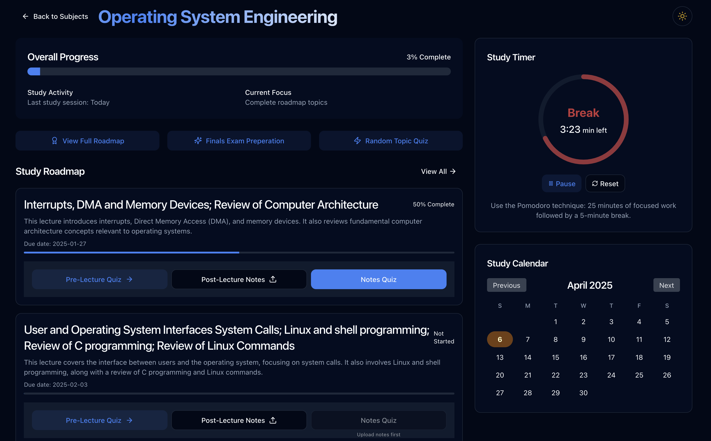
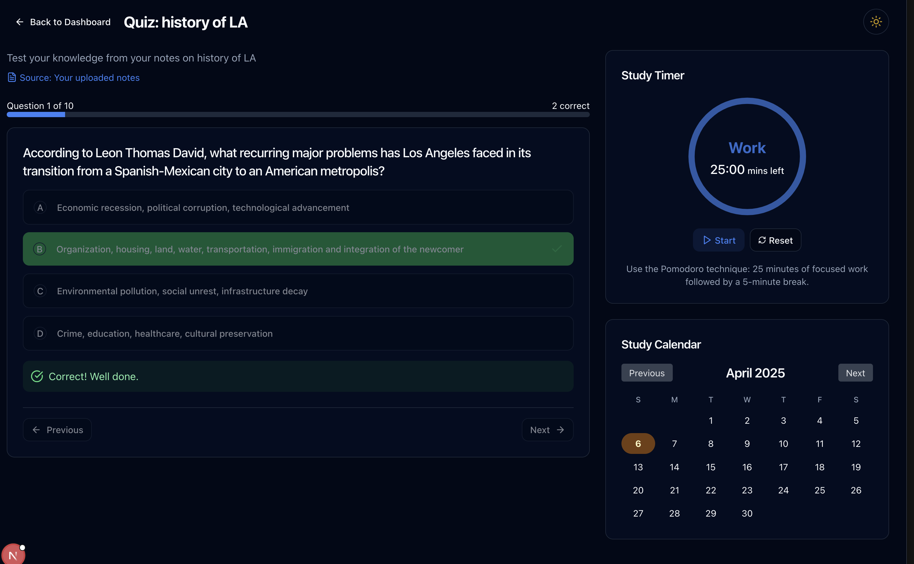
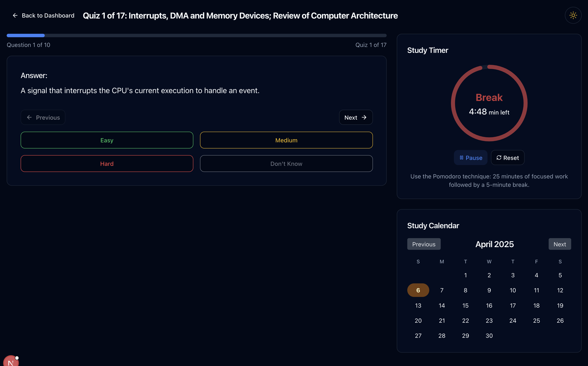

# 📚 Deepify - The Intelligent Study Companion 🧠

Deepify is an AI-powered study platform that transforms how students engage with course materials by creating personalized learning roadmaps and adaptive quizzes.

## ✨ Features

### 📋 Course Management

- **Syllabus Processing** - Upload your course syllabus (PDF/DOCX) and get an AI-generated study roadmap
- **Custom Courses** - Create and manage your own courses
- **Progress Tracking** - Monitor your learning journey with visual progress indicators

### 🧩 Smart Quizzes

- **Pre-lecture Quizzes** - Test your knowledge before diving into topics
- **Notes-based Quizzes** - Generate quizzes from your own notes
- **Handwritten Notes Analysis** 📝 - Take photos of your handwritten notes and let AI generate quizzes
- **Spaced Repetition** ⏰ - Smart scheduling of review questions based on your confidence ratings

### 📝 Note Taking

- **Flexible Formats** - Add notes as text, upload PDFs/DOCXs, or take photos of handwritten notes
- **Content Extraction** - Automatic text extraction from uploaded documents
- **Image Support** - Store and view images alongside your notes

## 🚀 Getting Started

### Prerequisites

- Python 3.10+
- MongoDB Atlas account
- Google Gemini API key

### Backend Setup

1. Clone the repository
2. Set up environment variables:
   ```bash
   export GOOGLE_API_KEY="your_gemini_key"
   export MONGODB_URI="your_mongodb_atlas_uri"
   ```
3. Install dependencies:
   ```bash
   pip install -r requirements.txt
   ```
4. Start the server:
   ```bash
   uvicorn main:app --reload
   ```

### Frontend Setup

1. Navigate to the frontend directory
2. Install dependencies:
   ```bash
   npm install
   ```
3. Start the development server:
   ```bash
   npm run dev
   ```

## 🔧 Technologies

### Frontend

- ⚛️ Next.js
- 🎨 Tailwind CSS
- 🧰 TypeScript
- 📊 React components for interactive UI

### Backend

- 🐍 FastAPI
- 🗄️ MongoDB Atlas
- 🤖 Google Gemini AI
- 📄 PDF & DOCX processing

## 📱 Key User Journeys

1. **Course Creation** - Upload a syllabus and get an instant roadmap
2. **Pre-lecture Preparation** - Take AI-generated quizzes to prepare for upcoming topics
3. **Notes Enhancement** - Convert notes into interactive quizzes
4. **Spaced Learning** - Review material at optimal intervals for better retention
5. **Handwritten Notes** - Snap photos of your notes for automatic digitization and quiz generation

## 🔮 Future Enhancements

- 📊 Analytics dashboard with learning insights
- 👥 Collaborative study groups
- 🔄 Integration with learning management systems
- 📱 Mobile app version

## ⚠️ Limitations

- Handwriting analysis works best with clear, well-spaced writing
- PDF extraction might not preserve complex formatting
- API rate limits apply for the free tier of Gemini AI





## 📄 License

This project is licensed under the MIT License - see the LICENSE file for details.
