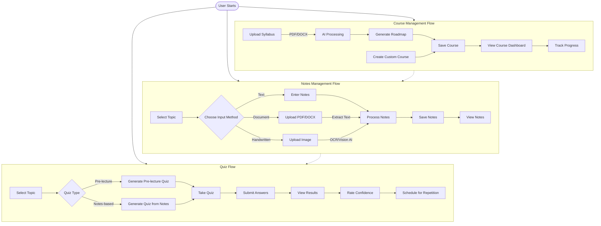
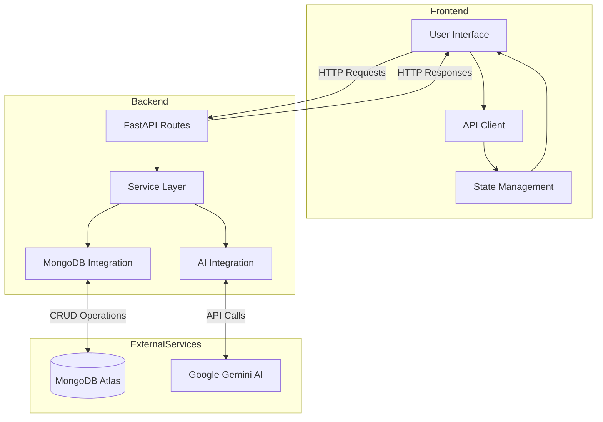
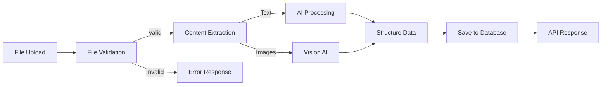
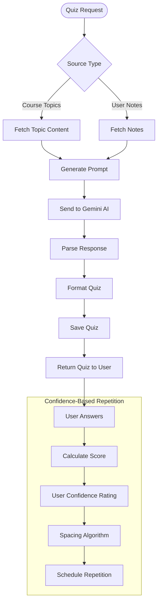

# 🔄 Deepify Workflow Diagram

The following diagram illustrates the main workflows and user journeys in the Deepify application.

## User Journey

## Data Flow Architecture

## Document Processing Pipeline

## Quiz Generation Workflow

